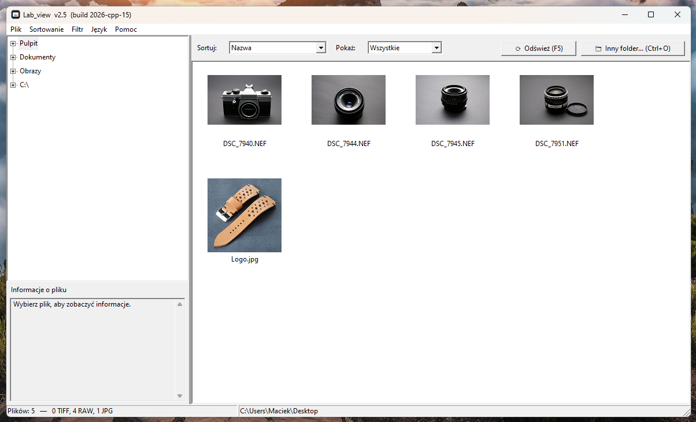

# Lab View

[Polski](#polski) | [English](#english)



---

## Polski

Przeglądarka zdjęć dla Windows, napisana w C++ na czystym WinAPI (bez frameworków). Pokazuje miniatury plików z wybranego folderu, odczytuje dane EXIF i otwiera pliki NEF / RAF / TIFF w programie LabSim. Towarzysz programu LabSim.

---

## Funkcje

- Drzewo folderów (Pulpit, Dokumenty, Obrazy, dyski) i siatka miniatur 128×128 px
- Miniatury ładowane w tle — okno nie zawiesza się przy dużych folderach
- Sortowanie: po nazwie, po dacie (najnowsze), po rozmiarze (największe)
- Filtr: wszystkie / TIFF / RAW / JPG
- Panel „Informacje o pliku”: wymiary, rozmiar pliku, aparat, obiektyw, ekspozycja, data wykonania (EXIF)
- Okno podglądu dużego obrazu z nawigacją ← / →
- Przycisk „Edytuj w LabSim” dla plików NEF, RAF, TIF, TIFF
- Interfejs w 3 językach (polski, angielski, włoski) z przełączaniem w locie
- Ciemny pasek tytułu okien zgodny z motywem systemu Windows; okno podglądu ma ciemne tło
- Zapamiętuje ostatni folder, sortowanie, filtr, szerokość panelu i język

---

## Obsługiwane formaty

| Grupa | Rozszerzenia | Co można zrobić |
|---|---|---|
| RAW (LabSim) | `.nef` `.raf` | miniatura, podgląd, otwarcie w LabSim |
| TIFF | `.tif` `.tiff` | miniatura, podgląd, otwarcie w LabSim |
| RAW (inne) | `.cr2` `.cr3` `.arw` `.dng` `.rw2` `.orf` `.raw` | miniatura, podgląd (bez LabSim) |
| JPG | `.jpg` `.jpeg` | miniatura, podgląd |

Pliki RAW są dekodowane przez Windows Imaging Component (WIC), więc działają tylko wtedy, gdy w systemie jest zainstalowany kodek dla danego aparatu.

---

## Wymagania

- Windows 7 lub nowszy (cel kompilacji: `_WIN32_WINNT 0x0601`)
- Do otwierania plików w LabSim: `Lab_Sim.exe` w tym samym folderze co `Lab_view.exe` (LabSim jest osobnym programem, nie ma go w tym repozytorium)
- Do kompilacji: Visual Studio z workloadem „Desktop development with C++” (MSVC, C++17)

---

## Struktura repozytorium

```
Lab_view/
├── README.md
├── LICENSE
├── .gitignore
├── build.bat
├── Lab_view.cpp
├── Lab_view.rc
├── resource.h
├── lab_view.ico
├── docs/
│   └── screenshot.png
└── languages/
    ├── pl.json
    ├── en.json
    └── it.json
```

---

## Kompilacja

1. Zainstaluj Visual Studio (Community wystarczy) z workloadem „Desktop development with C++”
2. Uruchom `build.bat` — skrypt sam znajdzie Visual Studio (`vswhere`), skompiluje zasoby (`rc`) i program (`cl`)
3. Gotowy plik: `Lab_view.exe`

Program jest linkowany statycznie (`/MT`), więc nie wymaga instalowania Visual C++ Redistributable.

---

## Uruchomienie

Folder z programem musi wyglądać tak:

```
Lab_view.exe
Lab_Sim.exe          (opcjonalnie, do edycji w LabSim)
languages\
    pl.json
    en.json
    it.json
```

Bez folderu `languages` program pokaże ostrzeżenie i wyświetli same nazwy kluczy zamiast tekstów.

---

## Obsługa

| Skrót | Akcja |
|---|---|
| `F1` | O programie |
| `F2` | Skróty klawiszowe |
| `F5` | Odśwież folder |
| `Space` | Podgląd zaznaczonego pliku |
| `Enter` / dwuklik | NEF, RAF, TIF, TIFF → otwórz w LabSim; JPG → podgląd |
| `Esc` | Zamknij podgląd |
| `←` / `→` | Poprzednie / następne zdjęcie (w podglądzie) |
| `Ctrl+O` | Wybierz folder |
| `Ctrl+L` | Otwórz w LabSim |
| `Ctrl+S` / `Ctrl+D` / `Ctrl+Z` | Sortuj po nazwie / dacie / rozmiarze |
| `Ctrl+A` | Pokaż wszystkie obrazy |
| `Ctrl+1` / `Ctrl+2` / `Ctrl+3` | Filtr RAW / JPG / TIFF |

---

## Języki

Teksty interfejsu są w plikach `languages\<kod>.json`. Język można zmienić w menu **Język** (bez restartu). Przy pierwszym uruchomieniu wybierany jest język systemu (polski, włoski, w pozostałych przypadkach angielski).

Dodanie nowego języka nie wymaga kompilacji:
1. Skopiuj `languages\en.json` jako np. `de.json`
2. Zmień `_meta.name` (nazwa pokazywana w menu) i przetłumacz wartości
3. Uruchom program — nowy język pojawi się w menu **Język**

Brakujące klucze są pobierane z `en.json`. Pliki zapisuj w UTF-8.

---

## Ustawienia

Program zapisuje ustawienia w `lab_view_settings.json` obok `Lab_view.exe`: tryb sortowania, filtr, ostatni folder, położenie separatora paneli i język.

---

## Wsparcie projektu

Jeśli gra Ci się podoba i chcesz wesprzeć jej dalszy rozwój, możesz postawić mi wirtualną kawę:

<a href="https://suppi.pl/00maciek00" target="_blank"></a>

Dziękuję! ☕

---

## Licencja

Copyright 2026 Maciej Sikorski — S.M. DIY Home  
Licencja Apache 2.0. Szczegóły w pliku [LICENSE](LICENSE).

---

**Projekt:** S.M. DIY Home

**Wersja:** 2.5.0  
**Autor:** Maciej Sikorski  
**Data:** 2026-04-01  
**Licencja:** Apache 2.0

---
---

## English

A photo viewer for Windows written in C++ with plain WinAPI (no frameworks). It shows thumbnails of the files in a chosen folder, reads EXIF data and opens NEF / RAF / TIFF files in LabSim. A companion to the LabSim program.

---

## Features

- Folder tree (Desktop, Documents, Pictures, drives) and a grid of 128×128 px thumbnails
- Thumbnails are loaded in the background — the window stays responsive in large folders
- Sorting: by name, by date (newest), by size (largest)
- Filter: all / TIFF / RAW / JPG
- "File information" panel: dimensions, file size, camera, lens, exposure, date taken (EXIF)
- Large image preview window with ← / → navigation
- "Edit in LabSim" button for NEF, RAF, TIF, TIFF files
- Interface in 3 languages (Polish, English, Italian), switchable at runtime
- Dark window title bar following the Windows theme; the preview window has a dark background
- Remembers the last folder, sorting, filter, panel width and language

---

## Supported Formats

| Group | Extensions | What you can do |
|---|---|---|
| RAW (LabSim) | `.nef` `.raf` | thumbnail, preview, open in LabSim |
| TIFF | `.tif` `.tiff` | thumbnail, preview, open in LabSim |
| RAW (other) | `.cr2` `.cr3` `.arw` `.dng` `.rw2` `.orf` `.raw` | thumbnail, preview (no LabSim) |
| JPG | `.jpg` `.jpeg` | thumbnail, preview |

RAW files are decoded by the Windows Imaging Component (WIC), so they work only if a codec for your camera is installed in the system.

---

## Requirements

- Windows 7 or newer (compile target: `_WIN32_WINNT 0x0601`)
- To open files in LabSim: `Lab_Sim.exe` in the same folder as `Lab_view.exe` (LabSim is a separate program, not included in this repository)
- To build: Visual Studio with the "Desktop development with C++" workload (MSVC, C++17)

---

## Repository Structure

```
Lab_view/
├── README.md
├── LICENSE
├── .gitignore
├── build.bat
├── Lab_view.cpp
├── Lab_view.rc
├── resource.h
├── lab_view.ico
├── docs/
│   └── screenshot.png
└── languages/
    ├── pl.json
    ├── en.json
    └── it.json
```

---

## Building

1. Install Visual Studio (Community is enough) with the "Desktop development with C++" workload
2. Run `build.bat` — the script finds Visual Studio itself (`vswhere`), compiles the resources (`rc`) and the program (`cl`)
3. Result: `Lab_view.exe`

The program is statically linked (`/MT`), so the Visual C++ Redistributable is not required.

---

## Running

The program folder must look like this:

```
Lab_view.exe
Lab_Sim.exe          (optional, for editing in LabSim)
languages\
    pl.json
    en.json
    it.json
```

Without the `languages` folder the program shows a warning and displays raw key names instead of texts.

---

## Controls

| Shortcut | Action |
|---|---|
| `F1` | About |
| `F2` | Keyboard shortcuts |
| `F5` | Refresh folder |
| `Space` | Preview selected file |
| `Enter` / double-click | NEF, RAF, TIF, TIFF → open in LabSim; JPG → preview |
| `Esc` | Close preview |
| `←` / `→` | Previous / next image (in preview) |
| `Ctrl+O` | Choose folder |
| `Ctrl+L` | Open in LabSim |
| `Ctrl+S` / `Ctrl+D` / `Ctrl+Z` | Sort by name / date / size |
| `Ctrl+A` | Show all images |
| `Ctrl+1` / `Ctrl+2` / `Ctrl+3` | Filter RAW / JPG / TIFF |

---

## Languages

UI texts live in `languages\<code>.json`. Change the language in the **Language** menu (no restart needed). On first run the system language is used (Polish, Italian, otherwise English).

Adding a new language needs no compilation:
1. Copy `languages\en.json` as e.g. `de.json`
2. Change `_meta.name` (the name shown in the menu) and translate the values
3. Start the program — the new language appears in the **Language** menu

Missing keys fall back to `en.json`. Save files as UTF-8.

---

## Settings

The program stores its settings in `lab_view_settings.json` next to `Lab_view.exe`: sort mode, filter, last folder, panel splitter position and language.

---

## Support the project

If you enjoy the game and would like to support its further development, you can buy me a virtual coffee:

<a href="https://suppi.pl/00maciek00" target="_blank"></a>

Thank you! ☕

---

## License

Copyright 2026 Maciej Sikorski — S.M. DIY Home  
Licensed under Apache 2.0. See [LICENSE](LICENSE) for details.

---

**Project:** S.M. DIY Home

**Version:** 2.5.0  
**Author:** Maciej Sikorski  
**Date:** 2026-04-01  
**License:** Apache 2.0
